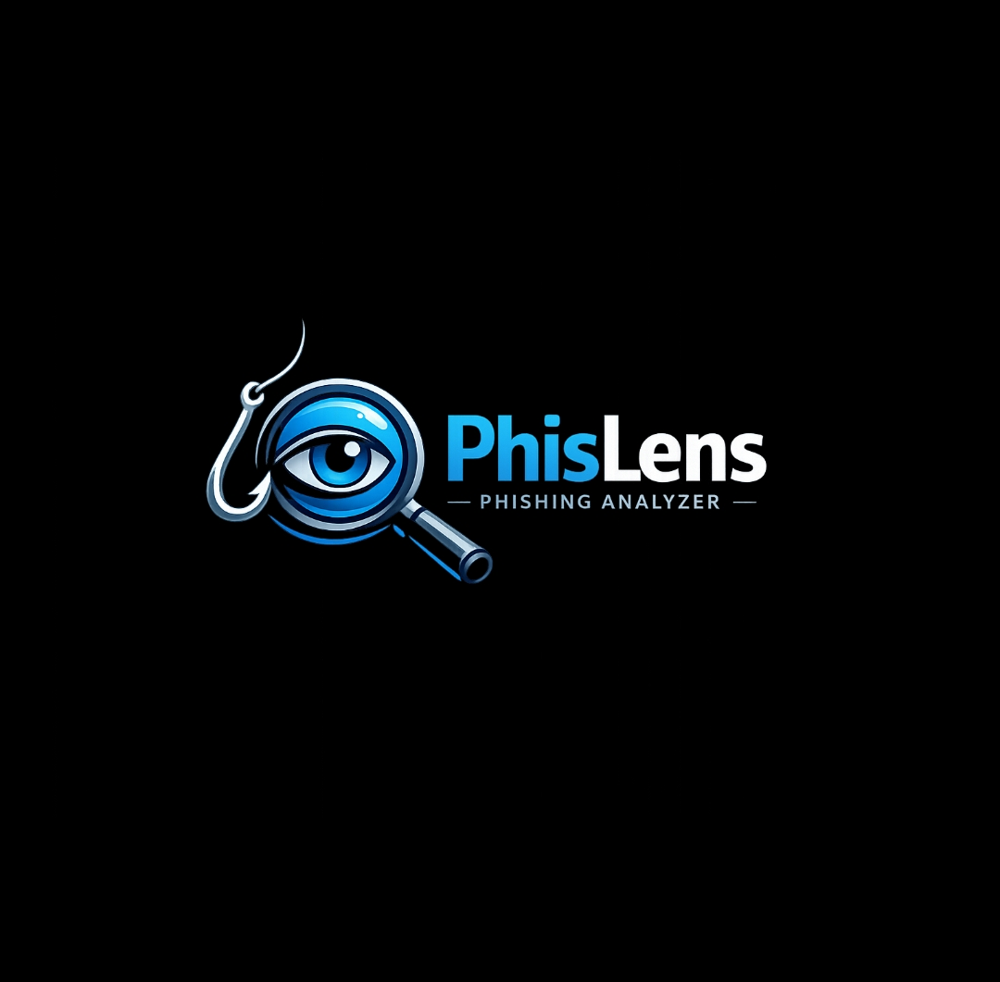
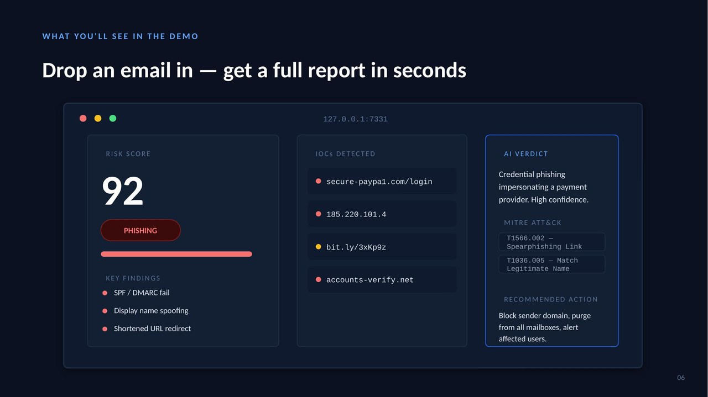
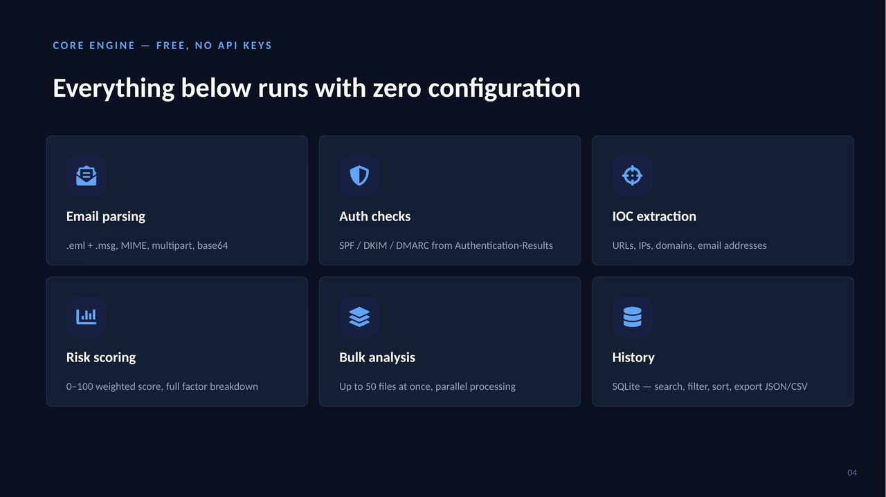
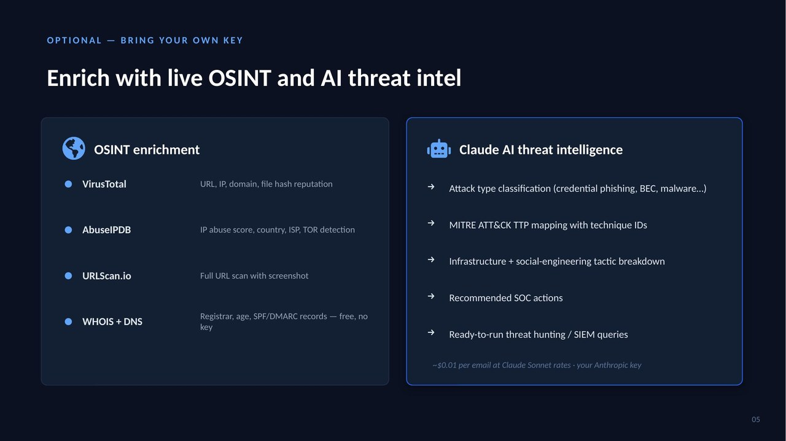
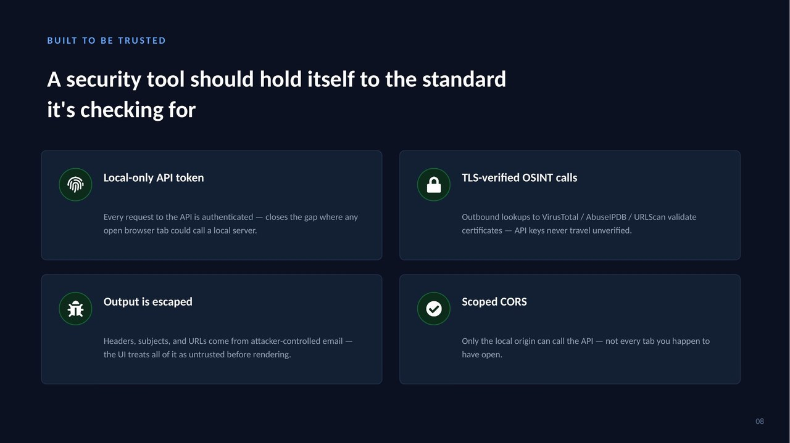

<p align="center">
  
</p>

<h1 align="center">PhishLens</h1>
<p align="center">
  <strong>Advanced Phishing Email Analyzer</strong><br>
  Free, local phishing email analyzer — parses .eml/.msg, extracts IOCs, checks SPF/DKIM/DMARC,<br>
  scores risk 0–100, and optionally enriches with VirusTotal, AbuseIPDB, URLScan, WHOIS, and Claude AI.<br>
  No cloud. Your emails stay on your machine.
</p>

<p align="center">
  
  
  
  
  
  
</p>

---

<a href="https://web-production-148cf.up.railway.app/">
  
</a>

Paste a raw email (`.eml` / headers) to analyze for phishing indicators.  
API keys (VirusTotal, AbuseIPDB, Anthropic) can be configured via the Settings tab.

---
<p align="center">
  
</p>

---

## What is PhishLens?

PhishLens is a **free, local, installable** phishing email analysis tool. Drop in an `.eml` or `.msg` file and get a full triage report in seconds — IOCs, auth failures, risk score, OSINT enrichment, and an AI-written threat intel summary — without sending your emails anywhere.

No subscription. No cloud upload. No mandatory API keys.

---

## Quick Start

```bash
git clone https://github.com/Boltx099/PhishLens
pip install -r requirements.txt
python run.py
```

Browser opens automatically at **http://127.0.0.1:7331**

---

## Features

<p align="center">
  
</p>

### Core Analysis — Free, No API Keys Required
| Feature | Description |
|---------|-------------|
| Email Parsing | Full `.eml` and `.msg` (Outlook) support — MIME, multipart, base64 |
| Header Analysis | From, To, Reply-To, X-Originating-IP, X-Mailer, Message-ID |
| Auth Checks | SPF / DKIM / DMARC — distinguishes `fail` vs `none` (active failure vs not configured) |
| IOC Extraction | URLs, IPs, domains, email addresses |
| URL Analysis | IP-based URLs, shorteners, lookalike domains, suspicious TLDs, credential keywords, HTTP on login pages |
| Brand Impersonation | 25 known brands — detects display name claiming brand but sending from unrelated domain |
| Lookalike Domain Detection | Regex patterns for char-substitution attacks (`paypa1`, `g00gle`, `arnazon`, `micros0ft`…) |
| IDN / Punycode Detection | Flags internationalized domain names used in homograph attacks |
| Attachment Analysis | Dangerous extension detection, double-extension trick, SHA256 + MD5 hashing |
| Spoofing Detection | Display name spoofing, Reply-To mismatch, free email provider for brand sender |
| Keyword Analysis | 6 weighted categories — credential harvest, account threat, urgency, financial scam, prize scam, credential request |
| Structural Signals | HTML-only body, missing Message-ID header |
| Received Chain | Full hop-by-hop relay trace |
| Risk Scoring | 0–100 calibrated score — clean emails with no SPF record score <25, brand impersonation with valid SPF still scores high |
| Bulk Analysis | Up to 50 files at once, parallel processing |
| History | SQLite persistence — search, filter, sort, export |
| Export | JSON, TXT (single) · CSV + JSON (bulk) |

### Detection coverage — tested scenarios

| Email type | Score | Verdict |
|---|---|---|
| Real phishing (SPF fail + spoofing + malicious URL) | 100 | PHISHING |
| PayPal impersonation with **valid** SPF/DKIM/DMARC | 67 | LIKELY PHISHING |
| BEC attack — reply-to hijack + wire transfer request | 68 | LIKELY PHISHING |
| Nigerian prince scam — `.tk` domain + financial keywords | 68 | LIKELY PHISHING |
| Legit newsletter — all auth pass, clean URLs | 0 | LIKELY CLEAN |
| Legit Amazon order confirmation | 0 | LIKELY CLEAN |

---

## OSINT + AI Enrichment

<p align="center">
  
</p>

### OSINT Integrations — Optional, Bring Your Own Key
| Service | What It Does | Free Tier |
|---------|-------------|-----------|
| VirusTotal | URL, IP, domain, file hash reputation | 4 req/min |
| AbuseIPDB | IP abuse score, country, ISP, TOR node detection | 1000 checks/day |
| URLScan.io | Full URL scan with screenshot | Free tier available |
| WHOIS | Registrar, creation date, age, newly-registered flag | Free — no key needed |
| DNS | A, MX, TXT, NS records + SPF/DMARC lookup | Free — no key needed |

### AI Analysis — Optional, Bring Your Own Key
Claude AI writes a full threat intelligence report per email:
- Attack type classification (credential phishing, BEC, malware delivery, …)
- MITRE ATT&CK TTP mapping with technique IDs
- Infrastructure + social-engineering tactic breakdown
- Recommended SOC actions
- Threat hunting / SIEM queries

> ~$0.01 per email at Claude Sonnet rates. Your Anthropic key, your cost.

---

## Security

<p align="center">
  
</p>

PhishLens analyzes attacker-controlled content — so it holds itself to the same standard:

- **Local API token** — every `/api/*` request is authenticated; no browser tab can call the API silently
- **TLS-verified OSINT calls** — VirusTotal / AbuseIPDB / URLScan requests validate certificates; API keys never travel unverified
- **Escaped output** — all email-derived data (subject, headers, URLs, IOCs) is HTML-escaped before rendering; no stored XSS
- **Scoped CORS** — only `127.0.0.1` / `localhost` origin allowed; `allow_origins=["*"]` is intentionally not used

---

## API Keys

All integrations are **100% optional**. The tool works fully without any API keys.

To add keys: run the tool → **Settings** tab → enter keys → **Save**.
Keys are stored locally in `phishlens_config.json` (gitignored — never committed).

| Service | Get Key |
|---------|---------|
| VirusTotal | https://virustotal.com/gui/my-apikey |
| AbuseIPDB | https://abuseipdb.com/account/api |
| URLScan.io | https://urlscan.io/user/profile |
| Anthropic (Claude AI) | https://console.anthropic.com/settings/keys |

---

## Run Options

```bash
python run.py                     # Default — port 7331, opens browser
python run.py --port 8080         # Custom port
python run.py --no-browser        # Don't auto-open browser
python run.py --host 0.0.0.0      # Expose on LAN
python run.py --reload            # Dev mode — auto-reload on code change
python run.py --data-dir ~/data   # Custom directory for DB and config
```

---

## Project Structure

```
PhishLens/
├── run.py                    ← Cross-platform launcher
├── requirements.txt          ← Python dependencies
├── .gitignore                ← Excludes config, DB, venv, build artifacts
├── CHANGELOG.md              ← Version history
│
├── backend/
│   ├── main.py               ← FastAPI server — all API routes + auth
│   ├── parser.py             ← Email parsing engine (.eml + .msg)
│   ├── osint.py              ← Async OSINT orchestrator
│   ├── ai_analysis.py        ← Claude AI threat intelligence engine
│   └── config.py             ← Config + local API token manager
│
├── frontend/
│   └── index.html            ← Single-file SPA
│
├── samples/
│   ├── sample_phishing.eml   ← Test phishing email (score: 100)
│   └── sample_clean.eml      ← Test clean email (score: 0)
│
└── assets/
    ├── logo.png
    ├── logo_dark.jpg
    └── slides/               ← README screenshots
```

---

## API Reference

| Method | Endpoint | Description |
|--------|----------|-------------|
| `POST` | `/api/analyze` | Upload single `.eml` or `.msg` |
| `POST` | `/api/analyze/raw` | Submit raw email text (paste mode) |
| `POST` | `/api/analyze/full` | Parse + OSINT + AI in one request |
| `POST` | `/api/analyze/bulk` | Upload up to 50 files at once |
| `POST` | `/api/osint/{id}` | Run OSINT on an existing analysis |
| `POST` | `/api/ai/{id}` | Run AI analysis on an existing analysis |
| `GET` | `/api/history` | List all past analyses |
| `GET` | `/api/history/{id}` | Get full result for one analysis |
| `DELETE` | `/api/history/{id}` | Delete one analysis |
| `DELETE` | `/api/history` | Clear all history |
| `GET` | `/api/stats` | Dashboard statistics |
| `GET` | `/api/config` | Read current settings (keys masked) |
| `POST` | `/api/config` | Save settings |
| `GET` | `/health` | Backend health check + service status |

---

## Linux Installation

### .deb Package — Ubuntu / Debian / Kali
```bash
bash packaging/build_deb.sh
sudo dpkg -i dist/phishlens_2.0.0_amd64.deb
phishlens
```
### Arch Linux
```bash
cd phishlens_arch
bash packaging/build_pkg.sh
sudo pacman -U dist/phishlens-*.pkg.tar.zst
phishlens
```

### AppImage — Any Linux x86_64 (no install needed)
```bash
bash packaging/build_appimage.sh
chmod +x dist/PhishLens-2.0.0-x86_64.AppImage
./dist/PhishLens-2.0.0-x86_64.AppImage
```

---

## Requirements

- Python 3.8+
- pip (dependencies install automatically on first run via `run.py`)

---

## Testing

```bash
# Drop these in the UI to verify everything works
samples/sample_phishing.eml   → Expected: PHISHING, Score ~100
samples/sample_clean.eml      → Expected: LIKELY CLEAN, Score ~0
```

---

## License

Apache-2.0 — free to use, modify, and distribute.

---

<p align="center">
  
  <br>
  <strong>Built by Boltx</strong>
</p>
